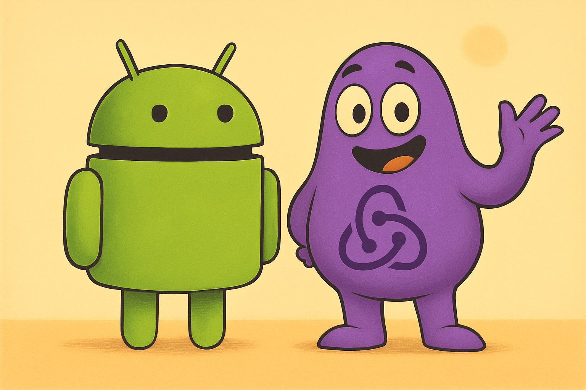
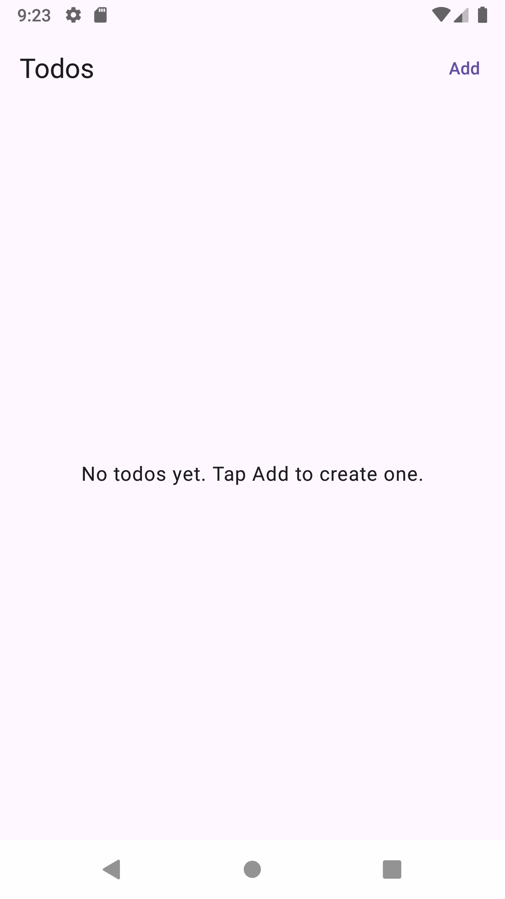
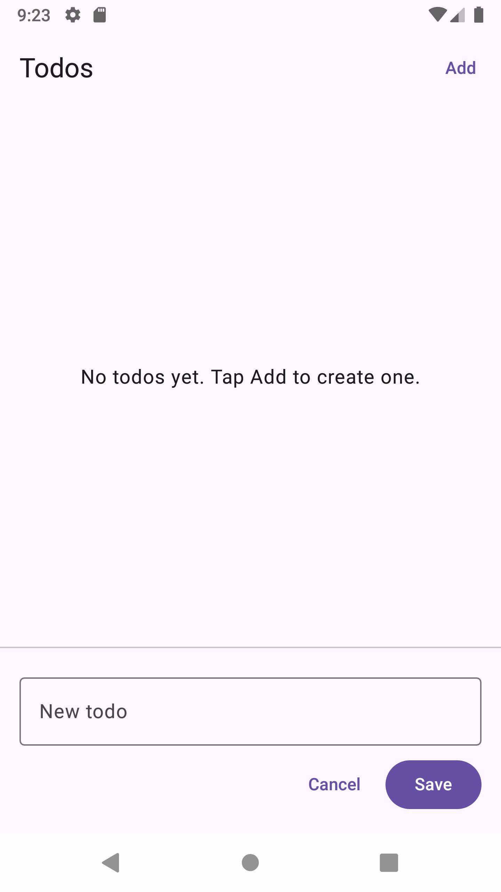
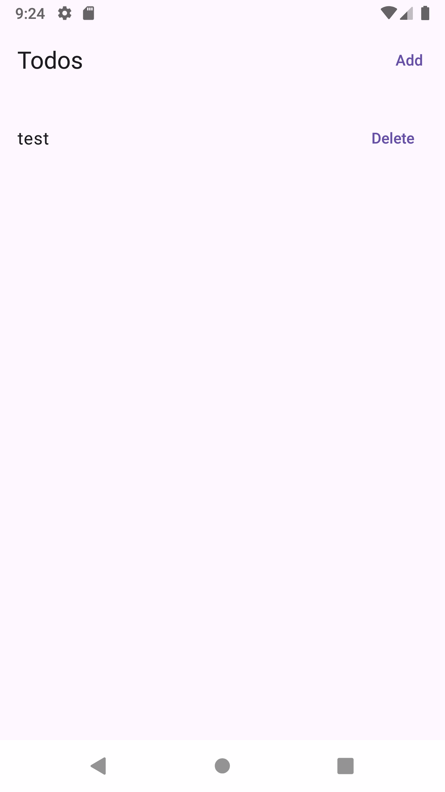
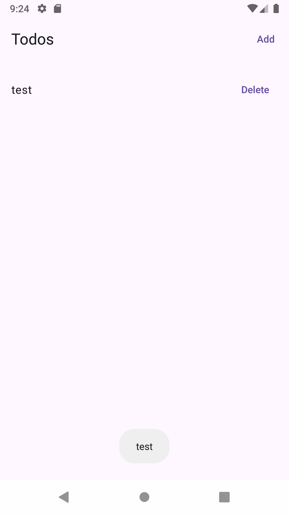

# Ghettoxide

_An android `Architecture` based on Redux_

[](https://jitpack.io/#Cortlandd/Ghettoxide)

# Installation
```kotlin
dependencyResolutionManagement {
    repositories {
        google()
        mavenCentral()
        maven("https://jitpack.io")
    }
}
```

```kotlin
dependencies {
    implementation("com.github.Cortlandd:Ghettoxide:1.0.4")
}
```

### Reducer helpers

Every `Reducer<S, A, E>` gets a few built-ins:

- `state { current -> current.copy(...) }` – atomically update state.
- `emit(effect)` – push a one-off effect (navigation, toast, etc.).
- `postAction(action)` – enqueue another action from inside the reducer or UI.
- `currentState` – read the latest state snapshot.

Example:

```kotlin
class CounterReducer : Reducer<CounterState, CounterAction, CounterEffect>() {

    override suspend fun process(action: CounterAction) {
        when (action) {
            CounterAction.Increment -> {
                val before = currentState.count
                state { it.copy(count = before + 1) }
                emit(CounterEffect.ShowToast("value used to be $before but now is ${currentState.count}"))
            }
        }
    }
}
```

# Basic Example App Screenshots

| Default State        | Adding Todo            | Todo Item Added        | Toast when tapping Todo |
|----------------------|------------------------|------------------------|-------------------------|
|  |  |  |   |

# Base Example (see app/ directory)

```kotlin
data class TodoState(
    var items: List<String?> = emptyList()
)

sealed interface TodoAction {
    data class Save(val todoName: String) : TodoAction
    data class DeleteTodo(val todoName: String) : TodoAction
    data class TappedTodo(val todoName: String) : TodoAction
}

sealed interface TodoEffect {
    data class ToastTodo(val todoName: String) : TodoEffect
}
```

```kotlin
class TodoReducer : Reducer<TodoState, TodoAction, TodoEffect>() {
    // Use this to kick off your first "load" event. Great for database, network calls, etc
    override fun onLoadAction(): TodoAction? {
        return null
    }

    override suspend fun process(action: TodoAction) {
        when (action) {
            is TodoAction.DeleteTodo -> {
                state {
                    val newItems = it.items.filter { it != action.todoName }
                    it.copy(items = newItems)
                }
            }
            is TodoAction.Save -> {
                state {
                    it.copy(items = it.items + action.todoName)
                }
            }
            is TodoAction.TappedTodo -> {
                emit(TodoEffect.ToastTodo(action.todoName))
            }
        }
    }
}
```

```kotlin
@OptIn(ExperimentalMaterial3Api::class)
@Composable
fun TodoScreen(
    state: TodoState,
    reducer: TodoReducer
) {
    var isAdding by remember { mutableStateOf(false) }
    var newTodo by remember { mutableStateOf(TextFieldValue("")) }

    fun startAdd() {
        isAdding = true
        newTodo = TextFieldValue("")
    }

    fun cancelAdd() {
        isAdding = false
        newTodo = TextFieldValue("")
    }

    fun saveTodo() {
        val trimmed = newTodo.text.trim()
        if (trimmed.isNotEmpty()) {
            reducer.postAction(TodoAction.Save(trimmed))
        }
        cancelAdd()
    }

    Scaffold(
        topBar = {
            TopAppBar(
                title = { Text("Todos") },
                actions = {
                    TextButton(onClick = { startAdd() }) {
                        Text("Add")
                    }
                }
            )
        }
    ) { innerPadding ->
        Column(
            modifier = Modifier
                .fillMaxSize()
                .padding(innerPadding)
        ) {

            // Background area above the input.
            // When we are in "adding" mode, tapping anywhere in this area cancels.
            Box(
                modifier = Modifier
                    .weight(1f)
                    .fillMaxWidth()
                    .clickable(enabled = isAdding) {
                        // Tapping outside the text field -> cancel
                        cancelAdd()
                    }
            ) {
                if (state.items.isEmpty()) {
                    Box(
                        modifier = Modifier.fillMaxSize(),
                        contentAlignment = Alignment.Center
                    ) {
                        Text("No todos yet. Tap Add to create one.")
                    }
                } else {
                    LazyColumn(
                        modifier = Modifier.fillMaxSize(),
                        contentPadding = PaddingValues(vertical = 8.dp)
                    ) {
                        items(state.items.filterNotNull()) { todo ->
                            TodoRow(
                                todoName = todo,
                                onTap = {
                                    reducer.postAction(TodoAction.TappedTodo(todo))
                                },
                                onDelete = {
                                    reducer.postAction(TodoAction.DeleteTodo(todo))
                                }
                            )
                        }
                    }
                }
            }

            if (isAdding) {
                Divider()

                Column(
                    modifier = Modifier
                        .fillMaxWidth()
                        .padding(16.dp)
                ) {
                    OutlinedTextField(
                        value = newTodo,
                        onValueChange = { newTodo = it },
                        modifier = Modifier.fillMaxWidth(),
                        label = { Text("New todo") },
                        singleLine = true,
                        keyboardActions = KeyboardActions(
                            onDone = { saveTodo() }
                        )
                    )

                    Spacer(modifier = Modifier.height(8.dp))

                    Row(
                        modifier = Modifier.fillMaxWidth(),
                        horizontalArrangement = Arrangement.End
                    ) {
                        TextButton(onClick = { cancelAdd() }) {
                            Text("Cancel")
                        }
                        Spacer(modifier = Modifier.width(8.dp))
                        Button(onClick = { saveTodo() }) {
                            Text("Save")
                        }
                    }
                }
            }
        }
    }
}

@Composable
private fun TodoRow(
    todoName: String,
    onTap: () -> Unit,
    onDelete: () -> Unit
) {
    Row(
        modifier = Modifier
            .fillMaxWidth()
            .clickable { onTap() }
            .padding(horizontal = 16.dp, vertical = 8.dp),
        horizontalArrangement = Arrangement.SpaceBetween,
        verticalAlignment = Alignment.CenterVertically
    ) {
        Text(todoName, style = MaterialTheme.typography.bodyLarge)

        TextButton(onClick = onDelete) {
            Text("Delete")
        }
    }
}

@Preview(showBackground = true)
@Composable
fun TodoScreenPreview() {
    val previewState = TodoState(
        items = listOf("Buy groceries", "Walk dog", "Pay bills")
    )

    MaterialTheme {
        TodoScreen(
            state = previewState,
            reducer = TodoReducer()
        )
    }
}
```

TodoFragment that handles the reducer effect and what Screen to display
```kotlin
class TodoFragment : FragmentReducer<TodoState, TodoAction, TodoEffect, TodoReducer>() {

    override var reducer: Reducer<TodoState, TodoAction, TodoEffect, TodoReducer> =
        TodoReducer()

    override val initialState: TodoState = TodoState()

    override fun onCreateView(
        inflater: LayoutInflater,
        container: ViewGroup?,
        savedInstanceState: Bundle?
    ) = ComposeView(requireContext()).apply {
        setContent {

            val state = vm.state.collectAsState().value
            TodoScreen(
                state = state,
                reducer = reducer as TodoReducer
            )
        }
    }

    override fun onEffect(effect: TodoEffect) {
        when(effect) {
            is TodoEffect.ToastTodo -> {
                Toast.makeText(requireContext(), effect.todoName, Toast.LENGTH_SHORT).show()
            }
        }
    }
}
```

Put it all together
```kotlin
class MainActivity : FragmentActivity() {
    override fun onCreate(savedInstanceState: Bundle?) {
        super.onCreate(savedInstanceState)
        enableEdgeToEdge()
        setContentView(R.layout.activity_main)
    }
}
```

```xml
<?xml version="1.0" encoding="utf-8"?>
<androidx.fragment.app.FragmentContainerView
    xmlns:android="http://schemas.android.com/apk/res/android"
    android:id="@+id/todo_fragment_container"
    android:layout_width="match_parent"
    android:layout_height="match_parent"
    android:name="com.cortlandwalker.ghettoxide_demo.features.todo.TodoFragment" />
```

# Updating tag
```
git tag x.x.x
git push origin x.x.x
```